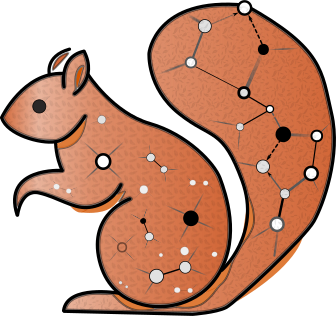

[](https://pypi.org/project/physquirrel/)
[](https://github.com/nholtgreve/squirrel/blob/main/LICENSE)
[](https://nholtgrefe.github.io/squirrel/)
[](https://doi.org/10.1093/molbev/msaf067)

# physquirrel



physquirrel is the Python library for **Squirrel**—an algorithm for reconstructing semi-directed
phylogenetic level-1 networks from quarnets and/or sequence alignments. It builds on
[phylozoo](https://github.com/nholtgrefe/phylozoo) for network representations and
[numba](https://numba.pydata.org/) for JIT-accelerated computation.

<br>

## Key Features

- **δ-heuristic**: construct quarnets (4-leaf subnetworks) from multiple sequence alignments in `.fasta` or `.nexus` format
- **Squirrel algorithm**: reconstruct semi-directed phylogenetic level-1 networks from quarnets
- **eNewick export**: serialize phylogenetic trees and networks in `eNewick` format
- **Visualization**: plot phylogenetic networks via the optional `viz` dependency

## Installation

```bash
pip install physquirrel
```

Runtime dependencies (`phylozoo`, `numpy`, `networkx`, `numba`) are installed automatically. For visualization extras:

```bash
pip install physquirrel[viz]
```

## Documentation

For the full manual, API reference, and installation guide, visit the **[physquirrel docs](https://nholtgrefe.github.io/squirrel/)**.

## Citation

If you use physquirrel, please cite:

> Niels Holtgrefe, Katharina T. Huber, Leo van Iersel, Mark Jones, Samuel Martin, and Vincent Moulton.
> **Squirrel: Reconstructing semi-directed phylogenetic level-1 networks from four-leaved networks or sequence alignments.**
> *Molecular Biology and Evolution*, 42(4):msaf067, 2025. doi: [10.1093/molbev/msaf067](https://doi.org/10.1093/molbev/msaf067)

## See also

For the graphical user interface developed for the paper, please go to [`gui/`](https://github.com/nholtgrefe/squirrel/tree/main/gui).

For the experimental materials corresponding to the paper, please go to [`experiments/`](https://github.com/nholtgreve/squirrel/tree/main/experiments).
